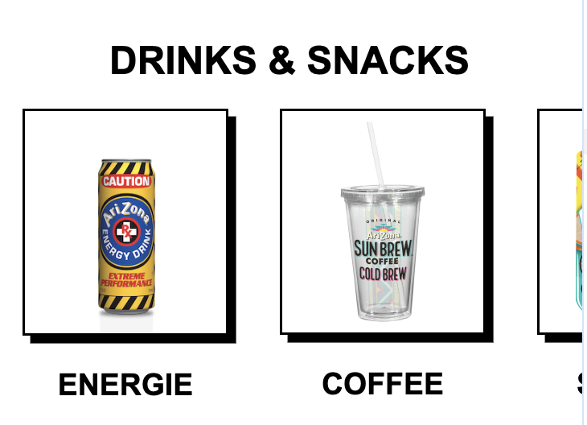
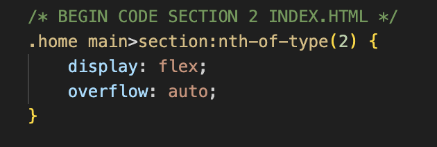
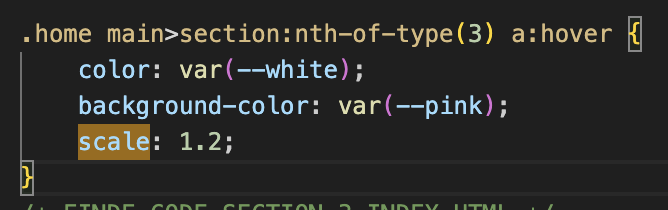
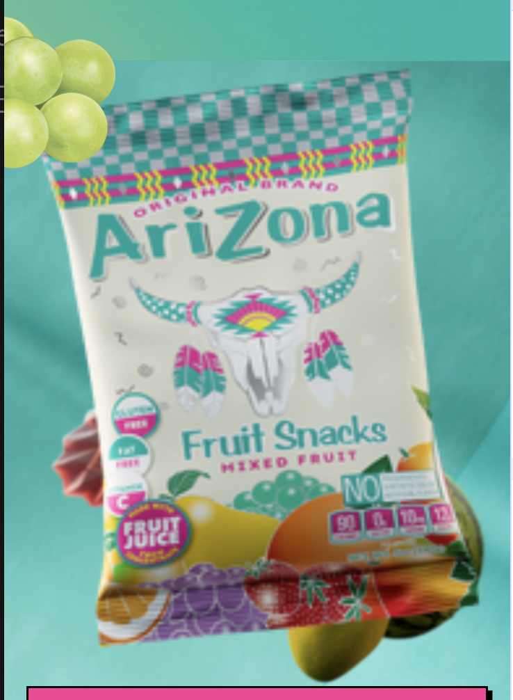
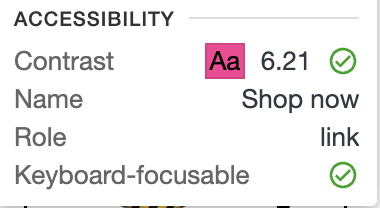
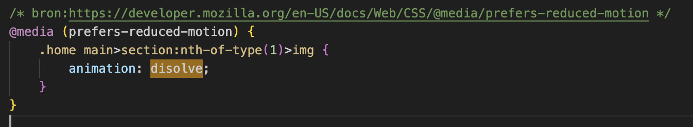
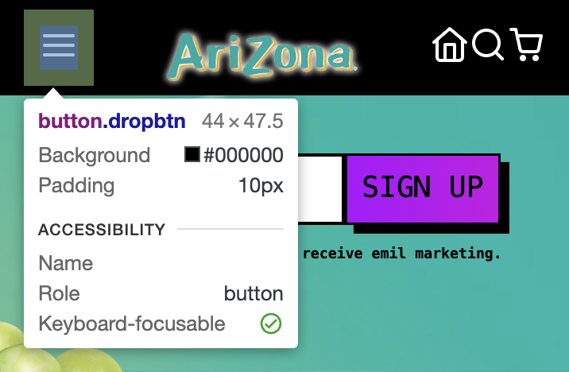

# Procesverslag
Markdown is een simpele manier om HTML te schrijven.  
Markdown cheat cheet: [Hulp bij het schrijven van Markdown](https://github.com/adam-p/markdown-here/wiki/Markdown-Cheatsheet).

Nb. De standaardstructuur en de spartaanse opmaak van de README.md zijn helemaal prima. Het gaat om de inhoud van je procesverslag. Besteedt de tijd voor pracht en praal aan je website.

Nb. Door *open* toe te voegen aan een *details* element kun je deze standaard open zetten. Fijn om dat steeds voor de relevante stuk(ken) te doen.

## Jij

  
uitwerken voor kick-off werkgroep

  ### Auteur:
  Saar bohm

  #### Je startniveau:
  hier je startniveau (Blauw)

  #### Je focus:
  hier je focus (surface plane)

## Je website

  
uitwerken voor kick-off werkgroep

  ### Je opdracht:
  https://drinkarizona.com/

  #### Screenshot(s) van de eerste pagina (small screen): 
  hier de naam van de pagina  
  

  #### Screenshot(s) van de tweede pagina (small screen):
  hier de naam van de pagina  
  
 

## Toegankelijkheidstest 1/2 (week 1)

  
uitwerken na test in 2e werkgroep

  ### Bevindingen
  Lijst met je bevindingen die in de test naar voren kwamen:
  Elastiek om vingers:
  - Pad moeilijk te gebruiken
  - Handiger met toetsenbord
  - Scherm erg moeilijk te scrollen

  Wazige bril:
  - Bijna niks leesbaar
  - Kleuren wel goed zichtbaar
  - Alleen erg grote teksten net leesbaar
  - Gekke lettertypes nauwlijks leesbaar

  Bril met zwart puntje:
  - kan niet goed recht vooruit kijken
  - rest wel scherp en goed zichtbaar
  - teksten gewoon leesbaar
  - teksten in groter lettertype fijner

## WCAG checklist

## Breakdownschets (week 1)

  
uitwerken na afloop 3e werkgroep

  ### de hele pagina: 
  

  ### dynamisch deel (bijv menu): 
  

  ### wellicht nog een dynamisch deel (bijv filter): 
  

## Voortgang 1 (week 2)

  
uitwerken voor 1e voortgang

  ### Stand van zaken
alle html van eerste pagina heb ik gemaakt. ben met de css begonnen al een stukje maar 
loop vaak vast met dingen centreren. Ook vind ik het moeilijk te begrijpen wanneer ik een h1 of h2 etc moet gebruiken.

  ### Agenda voor meeting
  heb niks met mijn groepje van te voren op gesteld, maar wel goed opgelet 
  bij de uitleg omdat dit misschien ook van toepassing kwam bij mijn code   

  ### Verslag van meeting
  hier na afloop snel de uitkomsten van de meeting vastleggen

  - header is css is is compleet en staat goed
  - alle teksten en images staan in het midden met de juiste margins en paddings

## Voortgang 2 (week 3)

  
uitwerken voor 2e voortgang

  ### Stand van zaken
  hier dit ging goed & dit was lastig (neem ook screenshots op van delen van je website en code)
alle html van mijn tweede pagina staat er ook in, alleen loop ik daar nog een beetje vast met een juiste grid. 
de teksten en plaatjes staan nog een beetje op een verkeerde hoogte. 
ook zijn er twee sections in de eerste pagina die 3 plaatjes naast elkaar moeten hebben. dit lukt me wel met display flex maar dan 
gaat de tekst ook naast de plaatjes terwijl die er onder moeten...

  ### Agenda voor meeting
  heb niks met mijn groepje van te voren op gesteld, maar wel goed opgelet 
  bij de uitleg omdat dit misschien ook van toepassing kwam bij mijn code

  ### Verslag van meeting
  hier na afloop snel de uitkomsten van de meeting vastleggen

  - geef 1 image en de tekst er bij een aparte section in de section met de display flex, dit zorgt ervoor dat de sections naast elkaar gaan 
  staan en niet alle images en headers.
  - bij de tweede pagina moet ik gebruik maken van heights en display flex en flex direction column.

## Toegankelijkheidstest 2/2 (week 4)

  
uitwerken na test in 9e werkgroep

  ### Bevindingen
  Lijst met je bevindingen die in de test naar voren kwamen (geef ook aan wat er verbeterd is):
- code nog valideren
- visible focus style (gemaakt)
- site can be rotated to any direction (paar dingen aangepast zoals paddings en margins dat het er al iets 
  beter uit ziet maar het is niet zo netjes)
- headings (heb ik verbeterd zodat alles netjes is)
- list items (deze heb ik niet gebruikt in mijn code)
- decorative images use null alt (heb ik aangepast in mijn code)
- provide a text alternative for complex images (ik had al een alt maar ik heb deze even verbeterd zodat het preciezer is voor de voice-over)
- focus state (heb ik goed naar gekeken en gezien dat deze al duidelijk genoeg is)
- skip link ( in de les gevraagd en dit was niet perse nodig voor je site, ik heb het nog een beetje geprobeerd maar ging moeilijk)
- dark light mode (was bij mijn site niet nodig dus voor reduce motion gegaan)
- animations dont flash to much (met reduce motion heb ik er voor gezorgd dat de animaties stoppen met bewegen als je dit instelt)
- ::selection colors (root had ik nog niet ingesteld met de colors maar heb ik nu verbeterd)
- in footer werden mijn '|' voor gelezen hard op bij de voice over (deze heb ik toen weggelaten)

## Voortgang 3 (week 4)

  
uitwerken voor 3e voortgang

  ### Stand van zaken
  hier dit ging goed & dit was lastig (neem ook screenshots op van delen van je website en code)
  mijn html en css code waren allebei al bijna af en dit begreep ik ook bijna helemaal. ik liep alleen tegen een paar puntjes aan namelijk:
  - wat een skiplink was en hoe belangrijk deze is
  - mn css code wat versimpelen
  - nog animaties toeveoegen
  - of ik een alternatief mocht gebruiken voor darkmode
  - of ik een tweede class kon gebruiken voor mijn body zodat mijn code in css goed gaat

  ### Agenda voor meeting
  heb niks met mijn groepje van te voren op gesteld, maar wel goed opgelet 
  bij de uitleg omdat dit misschien ook van toepassing kwam bij mijn code

  ### Verslag van meeting
  hier na afloop snel de uitkomsten van de meeting vastleggen

  - mag voor beide bodys een class gebruiken, dit zorgt dat de css code goed blijft
  - mag in plaats van dark mode 'prefers-reduced-motion' gebruiken omdat site al best donker is en zo zorg 
    je er voor dat animaties stoppen met bewegen als je dit instelt in instellingen
  - bij hover die je gebruikt om duidelijk te maken dat images een link zijn hoef je geen padding te gebruiken maar 'scale' is beter. 
    zo blijft de image netjes op zijn plaats staan. 
  - position relative en absolut gebruiken bij images die een beetje over elkaar vallen zodat je geen last hebt van de margins. 
    en gebruik dan ook een -index.

## Eindgesprek (week 5)

  
uitwerken voor eindgesprek

  ### Je uitkomst - karakteristiek screenshots:
  

  ### Dit ging goed/Heb ik geleerd: 
  Ik heb bijna alles opnieuw geleerd bij dit vak. niet alles ging in een keer goed maar ik heb goed mee gedaan met de huiswerk opdrachten en zo leerde ik stapje voor stapje dingen bij. wat ik heel leuk vind wat ik heb geleerd is het toegankelijk maken van de site. Dus de WCAG checklist was helemaal nieuw voor mij en ik vind het heel intressant dat ik deze nu zo goed mogelijk kan volgen. 

  
  

  ### Dit was lastig/Is niet gelukt:
  Wat helaas niet was gelukt is de site een beetje responsive te maken, soms staan de buttons net niet meer in het midden dan. En wat aan het einde helaas ook niet was gelukt is het dropdown menu klikbaar maken in de svg. de button om de svg is wel klikbaar maar de svg helaas niet. ik heb veel online opgezocht en ook hulp gevraagd aan klasgenoten en student assistenten maar dit werkte helaas niet...

  

## Bronnenlijst

  
continu bijhouden terwijl je werkt

  Nb. Wees specifiek ('css-tricks' als bron is bijv. niet specifiek genoeg). 
  Nb. ChatGpT en andere AI horen er ook bij.
  Nb. Vermeld de bronnen ook in je code.

  1. https://iconsvg.xyz/
  2. https://www.w3schools.com/howto/howto_js_dropdown.asp
  3. https://developer.mozilla.org/en-US/docs/Web/CSS/@media/prefers-reduced-motion
  4. https://www.w3schools.com/css/css_overflow.asp
  5. https://kinsta.com/blog/css-text-outline/
  6. https://cssgradient.io/
  7. https://codepen.io/theDeanH/pen/zBZXLN
  8. https://chat.openai.com/auth/login

